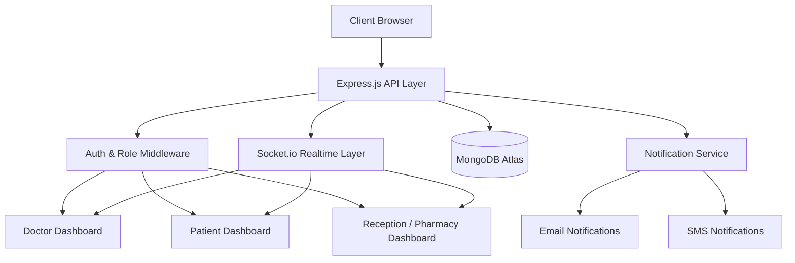
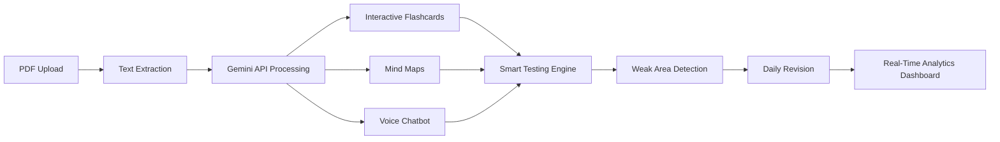
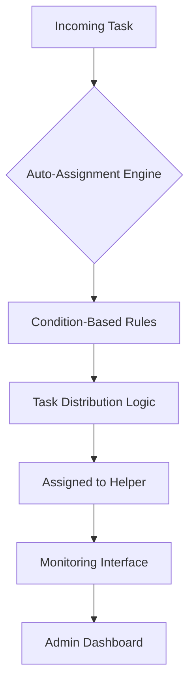
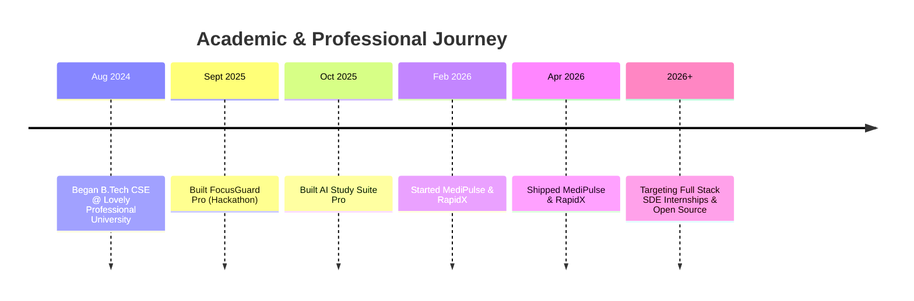

<div align="center">



<br/>

<a href="https://git.io/typing-svg">
  
</a>

<br/><br/>


&nbsp;


<br/><br/>

<a href="https://github.com/razashoeb840"></a>
<a href="https://www.linkedin.com/in/shoeb-raza-46b023322/"></a>
<a href="https://leetcode.com/u/razashoeb2358/"></a>
<a href="https://www.codechef.com/users/razashoeb2358"></a>
<a href="https://codeforces.com/profile/shoeb.raza2024"></a>
<a href="mailto:razashoeb840@gmail.com"></a>

<sub>📍 Jalandhar, India &nbsp;·&nbsp; ✉️ razashoeb840@gmail.com</sub>

</div>


<br/>

##  About Me

<table width="100%">
<tr>
<td width="58%" valign="top">

```yaml
whoami:
  name: "Shoeb Raza"
  role: "Full Stack Web Developer (in the making)"
  location: "Jalandhar, India"
  education: "B.Tech CSE — Lovely Professional University (Aug 2024 – Present)"
  cgpa: "8.89 / 10.00"
  focus: ["Full Stack Development", "DSA", "System Design", "Open Source"]
  philosophy: "Consistency beats motivation."
```

I am a Computer Science undergraduate who builds modern, scalable web applications
and solves algorithmic problems with intent, not just for practice. I care about
clean architecture, real-time systems, and shipping products that actually get used.
Currently deep in the MERN ecosystem, sharpening backend fundamentals, and pushing
my DSA rating across three competitive platforms simultaneously.

</td>
<td width="42%" valign="top" align="center">


</td>
</tr>
</table>

<div align="center">

### ⚡ Developer Philosophy

<table>
<tr>
<td align="center"><strong>BUILD</strong></td>
<td>→</td>
<td align="center"><strong>LEARN</strong></td>
<td>→</td>
<td align="center"><strong>DEBUG</strong></td>
<td>→</td>
<td align="center"><strong>IMPROVE</strong></td>
<td>→</td>
<td align="center"><strong>REPEAT</strong></td>
</tr>
</table>

*Consistency beats motivation. Build products people love.*

</div>


<br/>

## 🧩 Tech Stack — Bento Grid

<table width="100%">
<tr>
<td width="33%" valign="top" align="center">

**🌐 Frontend**
<br/><br/>


</td>
<td width="33%" valign="top" align="center">

**⚙️ Backend & Realtime**
<br/><br/>


</td>
<td width="34%" valign="top" align="center">

**🗄️ Database**
<br/><br/>


</td>
</tr>
<tr>
<td width="33%" valign="top" align="center">

**💻 Languages**
<br/><br/>


</td>
<td width="33%" valign="top" align="center">

**🔧 Tools**
<br/><br/>


</td>
<td width="34%" valign="top" align="center">

**🤖 AI / APIs**
<br/><br/>
 <sub>Gemini API</sub>

</td>
</tr>
</table>

<br/>

<div align="center">

### 📈 Proficiency



</div>

<br/>

<table width="100%">
<tr><th align="left">Category</th><th align="left">Skills</th></tr>
<tr><td><strong>Data Structures</strong></td><td>Arrays · Strings · Linked Lists · Stacks · Queues · Hash Maps · Trees · Graphs · Dynamic Programming</td></tr>
<tr><td><strong>Problem-Solving Patterns</strong></td><td>Two Pointers · Sliding Window · Kadane's Algorithm · Prefix Sum · Merge Intervals · Binary Search</td></tr>
<tr><td><strong>Relevant Coursework</strong></td><td>DSA · Computer Networks · Software Engineering · OOP · DBMS · Operating Systems</td></tr>
<tr><td><strong>Currently Learning</strong></td><td>Advanced Node.js/Express · REST API Design · Auth & Authorization · System Design · Open Source</td></tr>
</table>


<br/>

<div align="center">

# 🚀 Featured Projects

<sub>Selected work — architected, built, and shipped end-to-end</sub>

</div>

<br/>

<!-- ============ PROJECT 1 ============ -->

##  01 · MediPulse — Smart Hospital Management Platform

<p>


</p>

A full-scale, real-time hospital management system built to digitize hospital
operations end-to-end — from patient registration to billing — across role-based
dashboards, all synchronized live via WebSockets.

**🔗 Repository:** [`razashoeb840/MediPulse`](https://github.com/razashoeb840/MediPulse)
**🌐 Live Deployment:** [deploy-fcr3.onrender.com](https://deploy-fcr3.onrender.com/1index.html)
<sub>(hosted on Render's free tier — first load may take a few seconds to spin up)</sub>

<div align="center">

<br/><sub>👆 Swap the placeholder inside <code>assets/macbook-mockup.svg</code> with a real MediPulse screenshot URL</sub>
</div>

#### System Architecture



#### Core Feature Matrix

| Module | Capabilities |
|---|---|
| **Patient Management** | Real-time registration, token-based queue system, and complete patient history |
| **Doctor Consultation** | Live consultation workflow with digital prescriptions |
| **Role-Based Access** | Segregated Doctor / Patient / Reception authentication & secure permissions |
| **Appointments & Billing** | Live scheduling, automated invoice generation, and transaction records |
| **Pharmacy POS** | Point-of-sale billing integrated with real-time medicine inventory |
| **Inventory & Ward Management** | Medicine stock + bed/ward tracking with automatic stock updates |
| **Analytics Dashboard** | Operational insights across departments |
| **Notifications** | Email + SMS alerts for appointments, prescriptions, and updates |
| **Live Sync** | Socket.io-powered instant updates across every dashboard |

#### Why It Matters
MediPulse solves the coordination problem that plagues small-to-mid hospitals: three
different user roles working off three different mental models of the same patient.
By unifying them on one real-time data layer — token queues, pharmacy POS, and bed
management included — every dashboard reflects the same source of truth the instant
it changes.

<br/>

<!-- ============ PROJECT 2 ============ -->

##  02 · AI Study Suite Pro

<p>


</p>

An AI-powered learning companion that transforms static study material — PDFs,
notes, textbooks — into an interactive, personalized learning experience using the
Gemini API.

**🔗 Repository:** [`razashoeb840/AI_Study_suite`](https://github.com/razashoeb840/AI_Study_suite)

#### Learning Pipeline



#### Core Feature Matrix

| Feature | Description |
|---|---|
| **PDF → Interactive Content** | Converts raw study PDFs into structured, navigable material |
| **Smart Testing** | Real-time analytics with AI-powered weak-area detection |
| **Daily Revision** | Spaced, prioritized revision built from performance data |
| **Voice Chatbot** | Hands-free, context-aware Q&A grounded in the uploaded document |
| **Flashcards & Mind Maps** | Auto-generated interactive flashcards and visual concept maps |
| **Focus Mode** | Distraction-free study environment with multiple themes |
| **History & Preferences** | SQLite-backed tracking of study history, analytics, and user settings |

<br/>

<!-- ============ PROJECT 3 ============ -->

##  03 · RapidX — Smart Helper Auto-Assignment System

<p>


</p>

A web-based system that automatically assigns tasks to helpers based on predefined
conditions, with an interface to manage and monitor every assignment in real time.

#### Assignment Flow



#### Core Feature Matrix

| Feature | Description |
|---|---|
| **Automatic Task Assignment** | Rule-based engine assigns tasks by predefined conditions |
| **Efficient Distribution Logic** | Minimizes manual effort while balancing helper workload |
| **Monitoring Interface** | Real-time visibility into every assigned task |
| **Improved Efficiency** | Measurably reduced manual task-distribution overhead |

<sub>📌 Repository link not yet provided — send it over and I'll wire it into this section.</sub>

<br/>

<!-- ============ PROJECT 4 ============ -->

##  04 · FocusGuard Pro — Productivity Browser Extension

<p>


</p>

A browser extension built during a hackathon to help users reclaim focus — blocking
distracting websites and tracking productivity through background scripts and an
interactive UI.

**🔗 Repository:** [`sushantranjan912/FocusguardPro-hackathon`](https://github.com/sushantranjan912/FocusguardPro-hackathon)
<sub>Team hackathon build — hosted under a teammate's account</sub>

#### Core Feature Matrix

| Feature | Description |
|---|---|
| **Website Blocking** | Background scripts block user-defined distracting domains |
| **Browsing Activity Monitoring** | Tracks and logs time spent across sessions |
| **Focused Work Sessions** | Encourages and reinforces sustained focus periods |
| **Interactive UI** | Clean, responsive popup and settings interface |
| **Demo & Screenshots** | Integrated screenshots and demo to showcase functionality |


<br/>

## 🗓️ Timeline



<br/>

## 💼 Experience

<table width="100%">
<tr>
<td width="22%" align="center"><strong>Infosys Springboard</strong><br/><sub>Virtual Internship</sub><br/><sub>Aug 2024 – Present</sub></td>
<td width="78%">

Participating in a structured virtual internship focused on industry-oriented
technical skills and software development practices. Developing **CampusEventHub**,
an Angular-based platform where students can browse events, register, and track
event details.

- Implementing core features using **Angular Components**
- Building client-side **Routing** for multi-view navigation
- Developing **Services** for data handling and API communication
- Completing internship modules and technical assessments

</td>
</tr>
</table>

<br/>

## 🎓 Education

<table width="100%">
<tr>
<td width="68%">

**Bachelor of Technology — Computer Science & Engineering**
Lovely Professional University, Jalandhar, India
`August 2024 – Present`

**Relevant Coursework:** Data Structures & Algorithms · Computer Networks ·
Software Engineering · Object-Oriented Programming · Database Management Systems ·
Operating Systems

</td>
<td width="32%" align="center">


</td>
</tr>
</table>


<br/>

## 🏆 Achievements & Coding Profiles

<div align="center">

<a href="https://leetcode.com/u/razashoeb2358/">

</a>

<br/>

<table>
<tr><th>Platform</th><th>Problems Solved</th><th>Rating</th><th>Profile</th></tr>
<tr><td>LeetCode</td><td>200+</td><td><code>1419</code></td><td><a href="https://leetcode.com/u/razashoeb2358/">Visit →</a></td></tr>
<tr><td>CodeChef</td><td>110+</td><td><code>1432</code></td><td><a href="https://www.codechef.com/users/razashoeb2358">Visit →</a></td></tr>
<tr><td>Codeforces</td><td>Active</td><td><code>772</code></td><td><a href="https://codeforces.com/profile/shoeb.raza2024">Visit →</a></td></tr>
</table>

</div>

<br/>

## 📊 GitHub Analytics

<div align="center">


<br/>


<br/>


<br/><br/>


</div>

<br/>

<div align="center">

### 🐍 Contribution Snake


<sub>Powered by the <a href="https://github.com/Platane/snk">Platane/snk</a> GitHub Action — add the workflow below to your profile repo to activate this animation.</sub>

</div>

<details>
<summary><strong>⚙️ Snake animation setup (click to expand)</strong></summary>

Create `.github/workflows/snake.yml` in your `razashoeb840/razashoeb840` repo:

```yaml
name: Generate Snake
on:
  schedule:
    - cron: "0 0 * * *"
  workflow_dispatch:
jobs:
  build:
    runs-on: ubuntu-latest
    steps:
      - uses: Platane/snk@v3
        with:
          github_user_name: razashoeb840
          outputs: dist/github-contribution-grid-snake-dark.svg?palette=github-dark
      - uses: crazy-max/ghaction-github-pages@v4
        with:
          target_branch: output
          build_dir: dist
        env:
          GITHUB_TOKEN: ${{ secrets.GITHUB_TOKEN }}
```

</details>


<br/>

## 🎯 Current Goals

<table width="100%">
<tr>
<td align="center">☐ Solve 500+ DSA Problems</td>
<td align="center">☐ Master Full Stack Development</td>
<td align="center">☐ Build Industry-Level Projects</td>
</tr>
<tr>
<td align="center">☐ Contribute to Open Source</td>
<td align="center">☐ Sharpen Competitive Programming</td>
<td align="center">☐ Keep Learning Every Day</td>
</tr>
</table>

<br/>

## 📬 Let's Connect

<div align="center">

<a href="https://www.linkedin.com/in/shoeb-raza-46b023322/"></a>
<a href="https://github.com/razashoeb840"></a>
<a href="mailto:razashoeb840@gmail.com"></a>

<br/><br/>

<a href="#"></a>

<sub>Replace the link above with a direct URL to your hosted PDF (e.g. GitHub raw link or Google Drive share link).</sub>

</div>

<br/>


<div align="center">
<sub>Designed & built by Shoeb Raza · Thanks for stopping by ⚡</sub>
</div>
