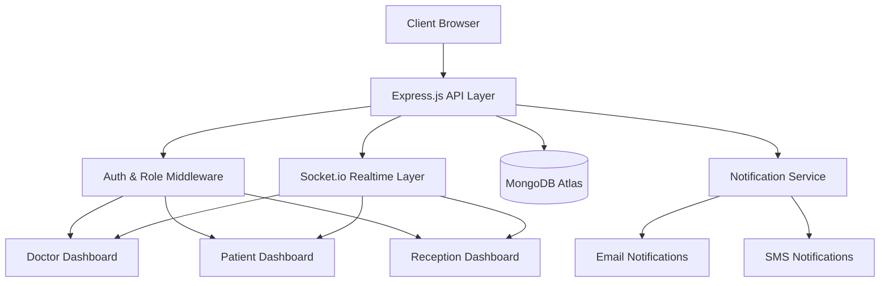
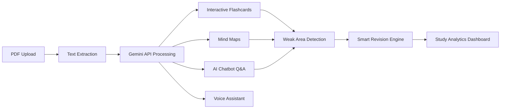
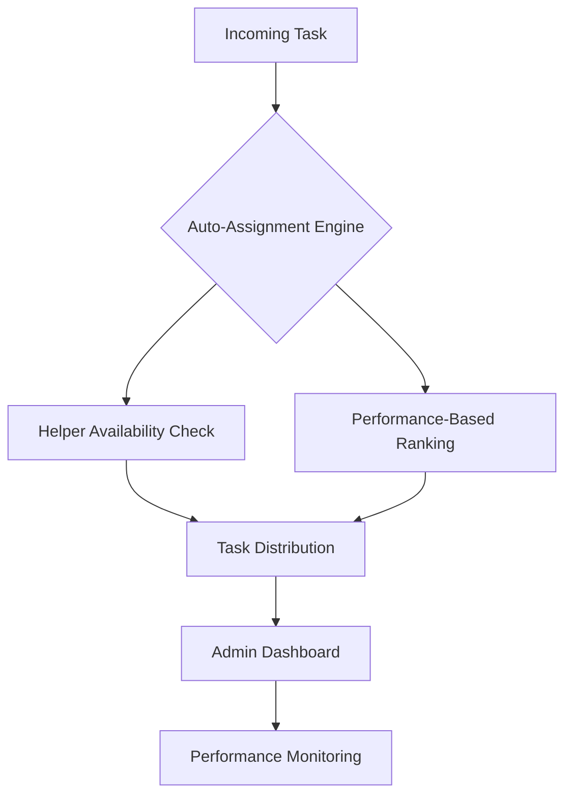
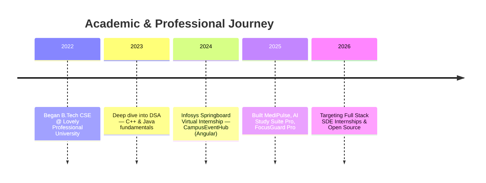

<div align="center">


<br/>

<a href="https://git.io/typing-svg">
  
</a>

<br/><br/>


&nbsp;


<br/><br/>

<a href="https://github.com/razashoeb840"></a>
<a href="https://www.linkedin.com/in/shoeb-raza-46b023322/"></a>
<a href="https://leetcode.com/u/razashoeb2358/"></a>
<a href="https://www.codechef.com/users/razashoeb2358"></a>
<a href="https://codeforces.com/profile/shoeb.raza2024"></a>
<a href="mailto:razashoeb840@gmail.com"></a>

</div>


<br/>

##  About Me

<table width="100%">
<tr>
<td width="60%" valign="top">

```yaml
whoami:
  name: "Shoeb Raza"
  role: "Full Stack Web Developer (in the making)"
  location: "India"
  education: "B.Tech, Computer Science & Engineering — Lovely Professional University"
  cgpa: "8.89 / 10.00"
  focus: ["Full Stack Development", "DSA", "System Design", "Open Source"]
  currently_building: "Scalable, real-world products"
  philosophy: "Consistency beats motivation."
```

I am a Computer Science undergraduate who builds modern, scalable web applications and
solves algorithmic problems with intent, not just for practice. I care about clean
architecture, real-time systems, and shipping products that actually get used — not
just demoed. Currently deep in the MERN ecosystem, sharpening backend fundamentals,
and pushing my DSA rating across three competitive platforms simultaneously.

</td>
<td width="40%" valign="top" align="center">


</td>
</tr>
</table>

<br/>

<div align="center">

### ⚡ Developer Philosophy

<table>
<tr>
<td align="center"><strong>BUILD</strong></td>
<td align="center">→</td>
<td align="center"><strong>LEARN</strong></td>
<td align="center">→</td>
<td align="center"><strong>DEBUG</strong></td>
<td align="center">→</td>
<td align="center"><strong>IMPROVE</strong></td>
<td align="center">→</td>
<td align="center"><strong>REPEAT</strong></td>
</tr>
</table>

*Consistency beats motivation. Build products people love.*

</div>


<br/>

##  Tech Stack

<div align="center">

**Languages**


**Frontend**


**Backend & Realtime**


**Database**


**Tools & Platforms**


</div>

<br/>

<table width="100%">
<tr>
<th align="left">Category</th>
<th align="left">Skills</th>
</tr>
<tr>
<td><strong>Data Structures</strong></td>
<td>Arrays · Strings · Linked Lists · Stacks · Queues · Hash Maps · Trees · Graphs · Dynamic Programming</td>
</tr>
<tr>
<td><strong>Problem-Solving Patterns</strong></td>
<td>Two Pointers · Sliding Window · Kadane's Algorithm · Prefix Sum · Merge Intervals · Binary Search</td>
</tr>
<tr>
<td><strong>Currently Learning</strong></td>
<td>Advanced Node.js/Express · REST API Design · Auth & Authorization · System Design · Open Source Contribution</td>
</tr>
</table>


<br/>

<div align="center">

# 🚀 Featured Projects

<sub>Selected work — architected, built, and shipped end-to-end</sub>

</div>

<br/>

<!-- ============ PROJECT 1 ============ -->

##  01 · MediPulse — Smart Hospital Management Platform

<p>


</p>

A full-scale, real-time hospital management system built to digitize and streamline
end-to-end hospital operations — from patient intake to billing — across three
distinct, role-based dashboards, all synchronized live via WebSockets.

**🔗 Repository:** [`razashoeb840/MediPulse`](https://github.com/razashoeb840/MediPulse)
**🌐 Live Deployment:** [deploy-fcr3.onrender.com](https://deploy-fcr3.onrender.com/1index.html)

#### System Architecture



#### Core Feature Matrix

| Module | Capabilities |
|---|---|
| **Patient Management** | Real-time record creation, updates, and history tracking |
| **Role-Based Access** | Segregated Doctor / Patient / Reception authentication & permissions |
| **Appointments** | Live scheduling engine with conflict detection |
| **Billing System** | Automated invoice generation and payment tracking |
| **Digital Prescriptions** | Paperless prescription issuing and retrieval |
| **Inventory** | Medicine stock tracking with low-stock alerts |
| **Analytics Dashboard** | Operational insights across departments |
| **Notifications** | Email + SMS alerts on appointments and prescriptions |
| **Live Sync** | Socket.io-powered instant updates across all dashboards |

#### Why It Matters
MediPulse solves the coordination problem that plagues small-to-mid hospitals: three
different user roles working off three different mental models of the same patient.
By unifying them on one real-time data layer, every dashboard reflects the same
source of truth the instant it changes.

<br/>

<!-- ============ PROJECT 2 ============ -->

##  02 · AI Study Suite Pro

<p>


</p>

An AI-powered learning companion that transforms static study material — PDFs,
notes, textbooks — into an interactive, personalized learning experience using the
Gemini API.

**🔗 Repository:** [`razashoeb840/AI_Study_suite`](https://github.com/razashoeb840/AI_Study_suite)

#### Learning Pipeline



#### Core Feature Matrix

| Feature | Description |
|---|---|
| **PDF → Interactive Content** | Converts raw study PDFs into structured, navigable material |
| **AI Chatbot** | Context-aware Q&A grounded in the uploaded document |
| **Flashcards** | Auto-generated, spaced-repetition ready flashcards |
| **Mind Maps** | Visual concept mapping generated from source content |
| **Voice Assistant** | Hands-free interaction for revision on the go |
| **Weak Area Detection** | Identifies low-performing topics from quiz interactions |
| **Smart Revision** | Prioritizes revision content based on detected weak areas |
| **Study Analytics** | Tracks study patterns and progress over time |

<br/>

<!-- ============ PROJECT 3 ============ -->

##  03 · RapidX — Smart Helper Auto-Assignment System

<p>


</p>

An intelligent task-distribution system designed to automatically assign incoming
tasks to available helpers based on load and performance, with a live admin
dashboard for oversight.

#### Assignment Flow



#### Core Feature Matrix

| Feature | Description |
|---|---|
| **Automatic Task Assignment** | Rule-based engine routes tasks without manual triage |
| **Task Distribution** | Load-balanced distribution across available helpers |
| **Admin Dashboard** | Centralized visibility into task flow and assignments |
| **Performance Monitoring** | Tracks helper efficiency and completion metrics |

<br/>

<!-- ============ PROJECT 4 ============ -->

##  04 · FocusGuard Pro — Productivity Browser Extension

<p>


</p>

A browser extension built during a hackathon to help users reclaim focus — blocking
distracting websites and surfacing productivity analytics in real time.

**🔗 Repository:** [`sushantranjan912/FocusguardPro-hackathon`](https://github.com/sushantranjan912/FocusguardPro-hackathon)

#### Core Feature Matrix

| Feature | Description |
|---|---|
| **Website Blocking** | Blocks user-defined distracting domains |
| **Productivity Tracking** | Logs time spent across browsing sessions |
| **Focus Analytics** | Visual breakdown of focused vs. distracted time |
| **Interactive UI** | Clean, responsive popup and settings interface |


<br/>

## 🗓️ Timeline



<br/>

## 💼 Experience

<table width="100%">
<tr>
<td width="20%" align="center"><strong>Infosys Springboard</strong><br/><sub>Virtual Internship</sub></td>
<td width="80%">

Worked on **CampusEventHub**, an Angular-based campus event management application.

- Built and structured reusable **Angular Components**
- Implemented client-side **Routing** for multi-view navigation
- Developed **Services** for data handling and API communication
- Gained industry-oriented exposure to structured frontend architecture

</td>
</tr>
</table>

<br/>

## 🎓 Education

<table width="100%">
<tr>
<td width="70%">

**Bachelor of Technology — Computer Science & Engineering**
Lovely Professional University

**CGPA:** `8.89 / 10.00`

**Relevant Coursework:** Data Structures & Algorithms · Object-Oriented Programming ·
Operating Systems · Database Management Systems · Computer Networks

</td>
<td width="30%" align="center">


</td>
</tr>
</table>


<br/>

## 🏆 Achievements & Coding Profiles

<div align="center">

<a href="https://leetcode.com/u/razashoeb2358/">

</a>

<br/>

<table>
<tr>
<th>Platform</th>
<th>Problems Solved</th>
<th>Rating</th>
<th>Profile</th>
</tr>
<tr>
<td>LeetCode</td>
<td>200+</td>
<td><code>1419</code></td>
<td><a href="https://leetcode.com/u/razashoeb2358/">Visit →</a></td>
</tr>
<tr>
<td>CodeChef</td>
<td>110+</td>
<td><code>1432</code></td>
<td><a href="https://www.codechef.com/users/razashoeb2358">Visit →</a></td>
</tr>
<tr>
<td>Codeforces</td>
<td>—</td>
<td><code>772</code></td>
<td><a href="https://codeforces.com/profile/shoeb.raza2024">Visit →</a></td>
</tr>
</table>

</div>

<br/>

## 📊 GitHub Analytics

<div align="center">


<br/>


<br/>


<br/><br/>


</div>

<br/>

<div align="center">

### 🐍 Contribution Snake


<sub>Powered by the <a href="https://github.com/Platane/snk">Platane/snk</a> GitHub Action — add the workflow to your profile repo to activate this animation.</sub>

</div>


<br/>

## 🎯 Current Goals

<table width="100%">
<tr>
<td align="center">☐ Solve 500+ DSA Problems</td>
<td align="center">☐ Master Full Stack Development</td>
<td align="center">☐ Build Industry-Level Projects</td>
</tr>
<tr>
<td align="center">☐ Contribute to Open Source</td>
<td align="center">☐ Sharpen Competitive Programming</td>
<td align="center">☐ Keep Learning Every Day</td>
</tr>
</table>

<br/>

## 📬 Let's Connect

<div align="center">

<a href="https://www.linkedin.com/in/shoeb-raza-46b023322/"></a>
<a href="https://github.com/razashoeb840"></a>
<a href="mailto:razashoeb840@gmail.com"></a>

<br/><br/>

<a href="#"></a>

<sub>Replace the resume link above with a direct link to your hosted PDF (e.g. Google Drive, GitHub raw link).</sub>

</div>

<br/>


<div align="center">
<sub>Designed & built by Shoeb Raza · Thanks for stopping by ⚡</sub>
</div>
